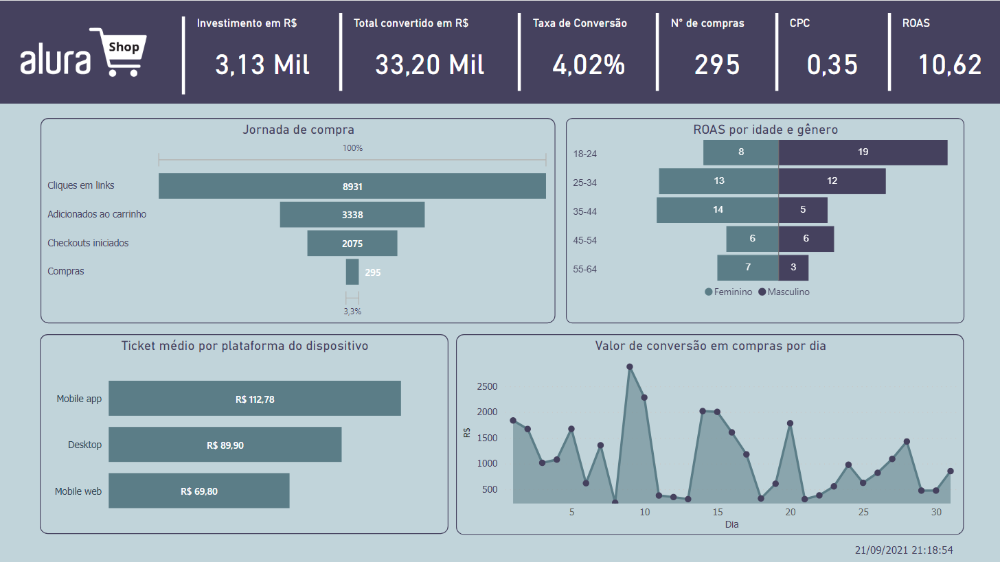
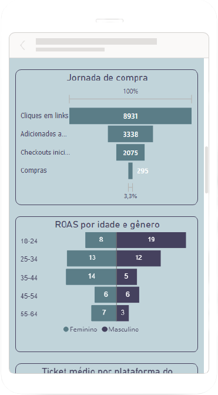

<h1> Alura Challenge BI </h1>

<h2> Week 02: Marketing Challenge - Alura Shop  </h2> 

>Alura Shop invested in digital advertisement and the company's management has doubts if the return of this advertisement had an effect. Our mission is to support management in its decisions, and clarify doubts.
>We developed a strategic marketing dashboard in order to monitor a paid advertising campaign during the month of July 2021. We will present relevant indicators for the strategic validation of the business.

<h3> Database </h3> 

> 
 Management provided two <a href="datasets"> database </a> containing access log. 
 
 

<table>
    <thead>
        <tr>
            <th>File ID</th>
            <th>File name</th>
            <th>Desciption</th>
            <th>Extension</th>
            <th>File size</th>
        </tr>
    </thead>
    <tbody>
        <tr>
            <td>1</td>
            <td>Tabela_dispositivos</td>
            <td>Access log on the page through different devices and web platforms.</td>
            <td>.json</td>
            <td>477 KB</td>
        </tr>
        <tr>
            <td>2</td>
            <td>Tabela_idade_e_genero</td>
            <td>Access log on the page for different genders and ages.</td>
            <td>.json</td>
            <td>277 KB</td>
        </tr>
    </tbody>
</table>

 

> 
These datasets presents following data fields.

 

<table>
    <thead>
        <tr>
            <th>File ID<th>
            <th>Variable</th>
            <th>Description</th>
        </tr>
    </thead>
    <tbody>
        <tr>
            <td> 1, 2 <td>
            <td>Dia</td>
            <td>Date</td>
        </tr>
        <tr>
            <td> 2 <td>
            <td>Idade</td>
            <td>Age</td>
        </tr>
        <tr>
            <td> 2 <td>
            <td>Gênero</td>
            <td>Gender</td>
        </tr>
        <tr>
            <td> 1 <td>
            <td>Plataforma do dispositivo</td>
            <td>On which device was the access: Desktop, mobile_app, all</td>
        </tr>
        <tr>
            <td> 1 <td>
            <td>Colocação</td>
            <td>Place where the advertisement was hosted</td>
        </tr>
        <tr>
            <td> 1 <td>
            <td>Plataforma</td>
            <td>Means of communication: facebook, instagram, etc</td>
        </tr>
        <tr>
            <td> 1, 2 <td>
            <td>Alcance</td>
            <td>Number of different people impacted by an ad</td>
        </tr>
        <tr>
            <td> 1, 2 <td>
            <td>Impressões</td>
            <td>How many times an ad was shown in sponsored campaigns. It actually means that the ad has started loading on the user's device, and in some cases it may not even have loaded at all</td>
        </tr>
        <tr>
            <td> 1, 2 <td>
            <td>Quantia gasta BRL</td>
            <td>How much was spent by the customer in BRL</td>
        </tr>
        <tr>
            <td> 1, 2 <td>
            <td>Cliques em links</td>
            <td>Number of clicks on links</td>
        </tr>
        <tr>
            <td> 1, 2 <td>
            <td>Visualizações por página</td>
            <td>View by page visited</td>
        </tr>
        <tr>
            <td> 1, 2 <td>
            <td>Compras no website</td>
            <td>Purchases on the page</td>
        </tr>
        <tr>
            <td> 1, 2 <td>
            <td>Compras no facebook</td>
            <td>Purchases on the facebook</td>
        </tr>
        <tr>
            <td> 1, 2 <td>
            <td>Adicionados ao carrinho</td>
            <td>Items added to cart</td>
        </tr>
        <tr>
            <td> 1, 2<td>
            <td>Valor de conversão adicionado ao carrinho</td>
            <td>Cart Conversion Value</td>
        </tr>
        <tr>
            <td> 1, 2 <td>
            <td>Checkouts Iniciados</td>
            <td>Checkouts Iniciados</td>
        </tr>
        <tr>
            <td> 1, 2 <td>
            <td>Valor de conversão dos checkouts iniciados</td>
            <td>Conversion Value of Initiated Checkouts</td>
        </tr>
        <tr>
            <td> 1, 2 <td>
            <td>Valor de conversão de compras</td>
            <td>Purchase conversion value</td>
        </tr>
        <tr>
            <td> 1, 2 <td>
            <td>Compras</td>
            <td>Number of purchases</td>
        </tr>
    </tbody>
</table>

<h3> Metrics </h3> 

> 
company's management requestes.

> 
<table align="center">
    <thead>
        <tr>
            <th> Metric </th>
            <th> Description </th>
        </tr>
    </thead>
    <tbody>
        <tr>
            <td> Total investido </td>
            <td> Total invested in the marketing campaign </td>
        </tr>
        <tr>
            <td> Total de compras </td>
            <td> Total invested in purchases </td>
        </tr>
        <tr>
            <td> Total convertido </td>
            <td> Total invested that was converted into e-commerce purchases </td>
        </tr>
        <tr>
            <td> CPC </td>
            <td> Cost per click </td>
        </tr>
        <tr>
            <td> Taxa de conversão </td>
            <td> how many people enter e-commerce and convert a sale </td>
        </tr>
        <tr>
            <td> Ticket Médio </td>
            <td> average ticket per device </td>
        </tr>
        <tr>
            <td> ROAS </td>
            <td> return on advertising investment by age and gender </td>
        </tr>
        <tr>
            <td> Valor convertido por dia </td>
            <td> Total invested that was converted into e-commerce purchases per day </td>
        </tr>
        <tr>
            <td> Jornada de compra </td>
            <td> purchase journey from page view to purchase made </td>
        </tr>
        <tr>
            <td> Atualização </td>
            <td> Update date and time </td>
        </tr>
    </tbody>
</table>
<h3> Dashboard </h3> 

    
    

<h3> Link Dashboard </h3> 

https://app.powerbi.com/view?r=eyJrIjoiOGRmMmY4MjUtMTFmNy00OGMxLTk4OWEtODk3N2E2NDZkMmJmIiwidCI6IjExZTcxNzgzLWMyZWEtNGZlZS04MzE4LTcxMjJmMThkNzUzNCJ9
